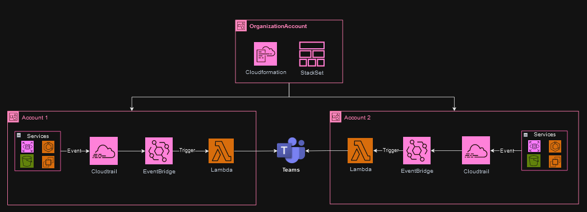

# Notificação de eventos no IAM
## Objetivo
Essa documentação tem como objetivo definir os principais pontos do processo de criação de AWS Lambdas no Multi-Account para que seja enviado uma notificação no Microsoft Teams através de um Webhook ao identificar eventos correspondentes.   

Conforme o diagrama acima, os recursos serão criados através do CloudFormation StackSet, onde o mesmo irá disparar o template em todas as contas da organização.

**Pré-requisitos**: *Deverá existir um AWS CloudTrail por conta.*

### Recursos Criados com o template

**FunctionIAMNotificateEvents** - *Criação do AWS Lambda.* \
**FunctionIamNotificationEventsRole** - *Criação da role utilizada pelo AWS Lambda.* \
**EventBridgeIAMNotificateEvents** - *Criação do Amazon EventBridge.* 
